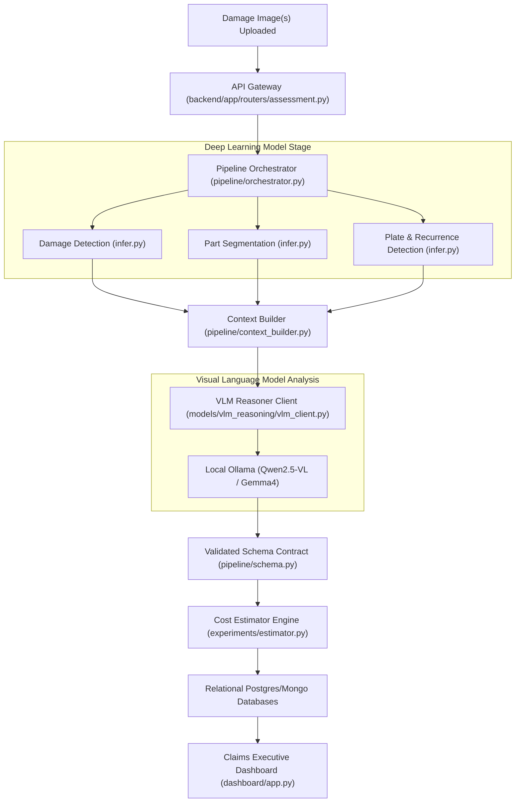

# 🚗 Car Damage MVP — Modular Claims Reconciler

Welcome to the **Car Damage MVP** repository. This is an advanced, production-grade automotive insurance AI adjuster microservice. It leverages custom neural networks for visual segmentation and local Vision-Language Models (VLM) via Ollama to automate visual vehicle inspections and produce Audatex-style itemized repair invoices.

---

## 🏗️ Project Architecture & Design Flow



---

## 👥 Team Ownership & Codeowners Structure

This project follows a strict modular codeownership structure to enable rapid, isolated feature development:

- **Damage Detection (`models/damage_detection/`)** - *[Member 1]*
  - YOLO-based damage classification (scratches, dents, cracks).
- **Part Segmentation (`models/part_segmentation/`)** - *[Member 2]*
  - Segment Anything Model (SAM) visual panel masking.
- **Plate & Recurrence (`models/plate_rc_detection/`)** - *[Member 3]*
  - Bounding-box license plate identification.
- **VLM Reasoning (`models/vlm_reasoning/`)** - *[Member 4]*
  - local vision-model prompt engineering & Ollama clients.
- **Claims Executive Dashboard (`dashboard/`)** - *[Member 5]*
  - Interactive front-end dashboard for claims adjusters.
- **FastAPI API Gateway (`backend/`)** - *[Member 6]*
  - Persistent PostgreSQL database migrations and uploads routers.

---

## 🚀 Quickstart Guide

### 1. Build and Initialize Databases
Mount Postgres pgvector and MongoDB using Docker Compose:
```bash
docker compose -f docker/docker-compose.yml up -d
```
*Database schemas are automatically loaded from [schema.sql](file:///Users/kokumar/Desktop/vehicle-damage-ai/backend/migrations/schema.sql).*

### 2. Install Project Dependencies
Install pinned base requirements and secondary packages:
```bash
pip install -r requirements-base.txt
pip install -r backend/requirements.txt
pip install -r dashboard/requirements.txt
```

### 3. Launch Services
Start the claims FastAPI Gateway and Streamlit front-end service:
```bash
# Launch FastAPI
uvicorn backend.app.main:app --host 0.0.0.0 --port 8000 --reload

# Launch Streamlit (in a separate terminal tab)
streamlit run dashboard/app.py
```
*Access your interactive claims dashboard at `http://localhost:8501`.*

---

## How to Run (Current Architecture)

```bash
# Terminal 1 — Start backend
uvicorn backend.app:app --host 0.0.0.0 --port 8000 --reload

# Terminal 2 — Start dashboard
streamlit run dashboard/app.py --server.port 8501

# Open browser
# http://localhost:8501
```
