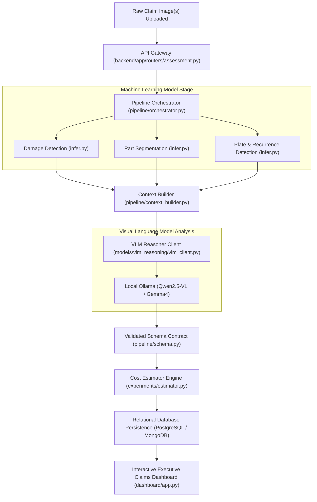

# System Architecture Documentation

This document describes the high-level architecture of the **Car Damage MVP** system.

## 🏗️ System Flow & Architecture Diagram

## 📂 Modular Design Philosophy
Each component is fully encapsulated to ensure high development isolation:
- **`models/`**: Submodules representing independent neural network boundaries. Other layers MUST ONLY communicate with models via their public `infer.py` interfaces.
- **`pipeline/`**: The orchestration plane that runs models sequentially and enforces validated output schemas using Pydantic.
- **`shared/`**: Common cross-module utility functions (Base64 encoding/decoding, claims logging formats).
- **`backend/`**: Relational FastAPI service layer handling claims persistence.
- **`dashboard/`**: Streamlit claims dashboard.
